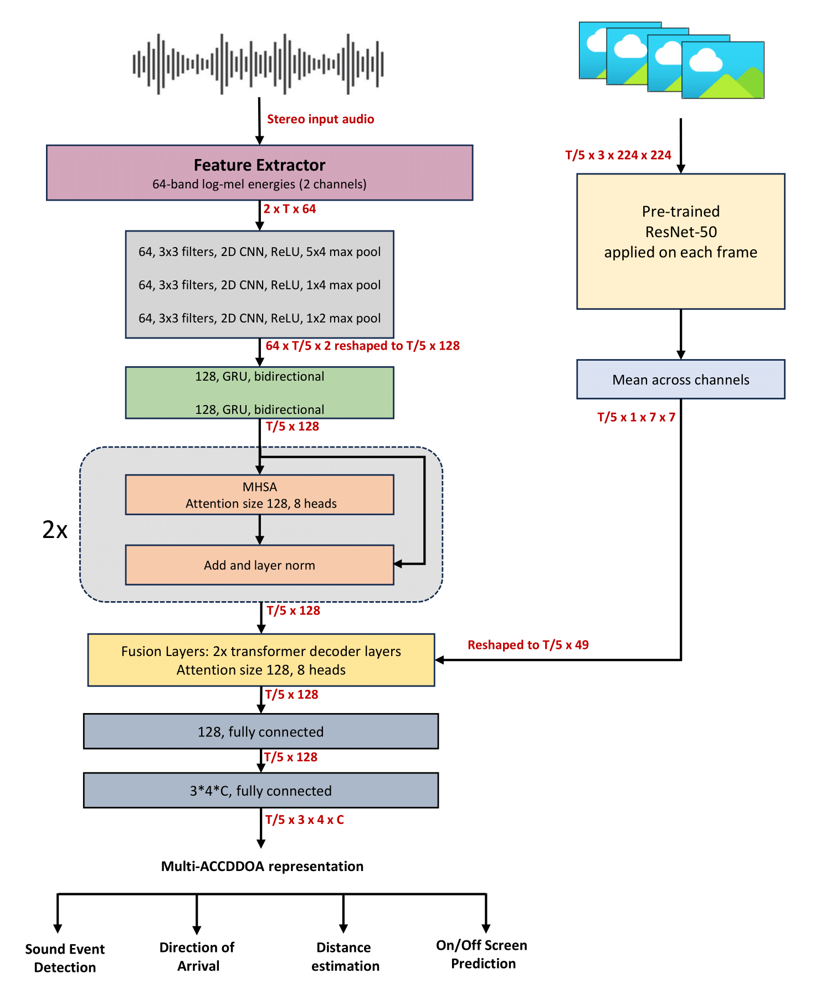

# DCASE 2025 Task 3 Baseline: Stereo sound event localization and detection in regular video content

[Please visit the official webpage of the DCASE 2025 Challenge for the task details](https://dcase.community/challenge2025/task-stereo-sound-event-localization-and-detection-in-regular-video-content).

This year's challenge features both an **audio-only** and an **audio-visual** track. Unlike previous editions, which utilized four-channel FOA/MIC format audio and 360-degree video, this year's challenge employs **stereo audio** and **standard video**. The dataset used for this challenge, Stereo SELD, is derived from the STARSS23 dataset, with each sample having a duration of 5 seconds. Details on the StereoSELD dataset creation process can be found in the task description page.

## Task Overview

Participants must detect sound events along with their direction of arrival (DOA) and distance. In the audio-visual track, an additional task involves determining whether a detected sound event is on-screen or off-screen. Since the input audio is stereo, participants are only required to predict the azimuth DOA. Furthermore, to address front-back confusion, all DOA values corresponding to the rear hemisphere are mapped to the front hemisphere.

## Baseline Model

<p align="center">
   
</p>

For the audio baseline, we modify the SELDnet studied in [1]. We introduced multi-head self-attention blocks in the SELDnet architecture based on the findings in [4]. For the output format, to support the detection of multiple instances of the same class overlapping we use the  Multi-ACCDOA representation [2] including distance estimation [5]. For the audio-visual baseline, inspired by the work in [3], we extract ResNet-50 features for the video frames corresponding to the input audio. The frame rate is set to 10fps. The visual features are fused with the audio features using transformer decoder blocks. The output of the transformer block is fed to linear layers for obtaining the Multi-ACCDDOA representation.

The input is the stereo audio and their corresponding video frames from which log-mel spectrogram and ResNet-50 features are extracted respectively. The model predicts all the active sound event classes for each frame along with their respective spatial location, producing the temporal activity and DOA trajectory for each sound event class. Each sound event class in the Multi-ACCDOA output is represented by three regressors that estimate the Cartesian coordinates x, y axes of the azimuth DOA around the microphone and a distance value. In case of the audio-visual model, there is an additional binary output neuron that predicts whether the sound event is within the video frame or outside of it. 


## Dataset

The Stereo SELD dataset, derived from STARSS23, comprises 30,000 real recordings, each 5 seconds long. Each recording includes stereo audio, standard video, and the corresponding detection and localization labels. For further details, please refer to the task description webpage.

**NOTE : Participants must use the fixed development test split provided in the baseline method for reporting development scores. The evaluation set will be released at a later stage.**
 
The development dataset can be downloaded from the link - [**DCASE2025 Task3 Stereo SELD Dataset**](https://doi.org/10.5281/zenodo.15087603)

[](https://doi.org/10.5281/zenodo.15087603)


**NOTE: Additional audio-visual synthetic data can be generated using the Spatial Scaper library, and the process for creating stereo versions of the synthetic data is detailed on the task description page.** 

## Project Structure

* `main.py` script serves as the entry point for the project. It coordinates all other scripts and executes the workflow.
* `data_generator.py` script is responsible for generating data and labels for training and evaluation.
* `extract_features.py` script extracts relevant features from the raw data (audio, visuals and labels(accdoa or multiaccdoa format)) to be used for model training.
* `inference.py` script handles model inference, allowing predictions on the trained model.
* `loss.py` script defines singleaccdoa and multiaccdoa(adpit) loss functions used during training.
* `metrics.py` script implements different evaluation metrics to assess model performance.
* `model.py` script defines the seld model architecture.
* `parameters.py` script contains all hyperparameters and configurations. If a user needs to modify parameters, they should update them here.
* `utils.py` script includes various utility functions used throughout the project.

## How to use this repo?

### Pre-requisites
The provided codebase has been tested on python 3.9 and torch 2.6

### Download and organize the dataset

1. **Download** the dataset from [](https://doi.org/10.5281/zenodo.15087603).
2. **Extract** the dataset into a root directory named `DCASE2025_SELD_dataset/`.
3. After unzipping, the directory structure should be:

```bash
DCASE2025_SELD_dataset/
├── stereo_dev/
│   ├── dev-train-tau/*.wav
│   ├── dev-train-sony/*.wav
│   ├── dev-test-tau/*.wav
│   ├── dev-test-sony/*.wav
├── metadata_dev/
│   ├── dev-train-tau/*.csv
│   ├── dev-train-sony/*.csv
│   ├── dev-test-tau/*.csv
│   ├── dev-test-sony/*.csv
├── video_dev/
│   ├── dev-train-tau/*.mp4
│   ├── dev-train-sony/*.mp4
│   ├── dev-test-tau/*.mp4
│   ├── dev-test-sony/*.mp4

```

4. If you generate synthetic data, place it into the respective folders under the name `dev-train-synth`. The baseline results reported here were trained using an additional synthetic dataset consisting of 15,000 5-second audio-visual samples.
   
### Inference on the Trained Model

To run inference using the provided baseline pre-trained models present in the `checkpoints` directory:

1. **Update** the `model_dir` in `inference.py` with the path to the pretrained model directory.
2. **Run inference** using the following command:
```bash
python inference.py
```

### Training the Stereo SELDnet Model

To train the model with default settings:

- `modality = 'audio_visual'`
- `multiaccdoa = True`

Run the following command:
```bash
python main.py
```

### Custom Training Configuration

To modify training settings:

1. Edit the `parameters.py` file to adjust the configurations according to your requirements.
2.  Run the following command to train with updated settings:
   ```bash
   python main.py
   ```
   
## Results on development dataset

### Metrics Overview
As the [SELD evaluation metric](https://www.aane.in/research/computational-audio-scene-analysis-casa/sound-event-localization-detection-and-tracking#h.ragsbsp7ujs) we employ the joint localization and detection metrics proposed in [6], with extensions from [2, 5] to support multi-instance scoring of the same class and distance estimation.

- **F-score (F<sub>20°</sub>)** – Primarily focused on detection, considering a prediction correct only if:
  - The predicted and reference class match.
  - The DOA angular error is within **20°**.
  - The relative distance error is below **1.0**.
    
- **F-score (F<sub>20°/on-off</sub>)** – Additional F-score for the audio-visual task, considering a prediction correct only if:
  - The predicted and reference class match.
  - The DOA angular error is within **20°**.
  - The relative distance error is below **1.0**.
  - The event is correctly identified as being On-screen or Off-screen.

- **DOA Angular Error (DOAE<sub>CD</sub>)** – Measures the class-dependent doa error in degrees.

- **Relative Distance Error (RDE<sub>CD</sub>)** – Defined as the difference between the estimated and reference distances, normalized by the reference distance.
- **On-screen/Off-screen accuracy** - Additionally, for the audio-visual track, we also evaluate the accuracy of predicting whether a detected sound event is on-screen or off-screen.

Unlike location-aware detection, no angular or distance thresholds are applied for **DOAE<sub>CD</sub>** and **RDE<sub>CD</sub>**.

The evaluation metric scores for the test split of the development dataset is given below. 

| Dataset | F<sub>20°</sub> | F<sub>20°/on-off</sub> | DOAE<sub>CD</sub> | RDE<sub>CD</sub> | on/off screen accuracy |
| ----| --- | --- | --- | --- | --- |
| Audio only | 22.78% | N/A | 24.5&deg; | 0.41 | N/A |
| Audio-visual| 26.77% | 20.0% | 23.8&deg; | 0.40 | 0.80 |

**Note:** The reported baseline system performance is not exactly reproducible due to varying setups. However, you should be able to obtain very similar results.

## Submission

* Make sure the file-wise output you are submitting is produced at 100 ms hop length. At this hop length a 5s audio file has 50 frames.

For more information on the submission file formats, [check the task webpage](https://dcase.community/challenge2025/task-stereo-sound-event-localization-and-detection-in-regular-video-content#submission)

## References

1. [Sharath Adavanne, Archontis Politis, Joonas Nikunen and Tuomas Virtanen, "Sound event localization and detection of overlapping sources using convolutional recurrent neural network" in IEEE Journal of Selected Topics in Signal Processing (JSTSP 2018)](https://arxiv.org/pdf/1807.00129.pdf)
2. [Kazuki Shimada, Yuichiro Koyama, Shusuke Takahashi, Naoya Takahashi, Emiru Tsunoo, and Yuki Mitsufuji, " Multi-ACCDOA: localizing and detecting overlapping sounds from the same class with auxiliary duplicating permutation invariant training" in The International Conference on Acoustics, Speech, & Signal Processing (ICASSP 2022)](https://arxiv.org/pdf/2110.07124.pdf)
3. [Davide Berghi, Peipei Wu, Jinzheng Zhao, Wenwu Wang, Philip J. B. Jackson, "Fusion of audio and audiovisual embeddings for sound event localization and detection" in the International Conference on Acoustics, Speech, & Signal Processing (ICASSP 2024)](https://arxiv.org/pdf/2312.09034.pdf)
4. [Parthasaarathy Sudarsanam, Archontis Politis, Konstantinos Drossos, "Assessment of Self-Attention on Learned Features For Sound Event Localization and Detection" in Proceedings of the 6th Detection and Classification of Acoustic Scenes and Events 2021 Workshop (DCASE2021)](https://dcase.community/documents/workshop2021/proceedings/DCASE2021Workshop_Sudarsanam_38.pdf)
5. [Daniel Aleksander Krause, Archontis Politis, Annamaria Mesaros, "Sound Event Detection and Localization with Distance Estimation" in arXiv: 2403.11827](https://arxiv.org/abs/2403.11827)
6. [Annamaria Mesaros, Sharath Adavanne, Archontis Politis, Toni Heittola, and Tuomas Virtanen, "Joint Measurement of Localization and Detection of Sound Events", IEEE Workshop on Applications of Signal Processing to Audio and Acoustics (WASPAA 2019)](https://ieeexplore.ieee.org/document/8937220)

## License

This repo and its contents have the MIT License.
